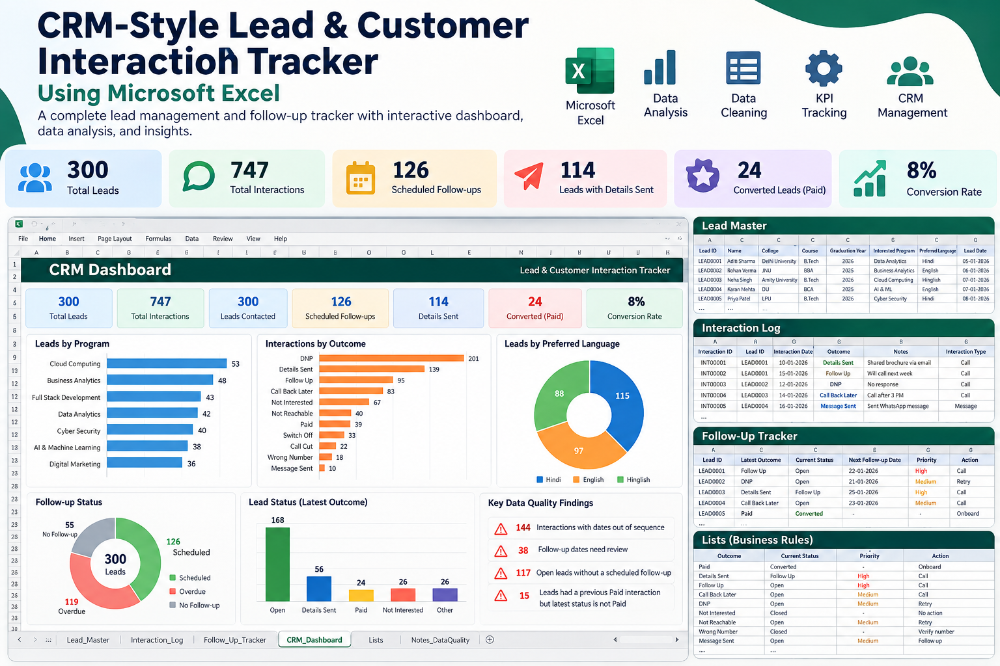

# CRM-Style Lead & Customer Interaction Tracker

A spreadsheet-based CRM built in Excel / Google Sheets to manage leads, customer interactions, follow-ups and communication outcomes for a BDA (Business Development Associate) style calling workflow.

> **Data note:** all data is synthetic (generated names, `example.com` e-mails, fictional phone numbers). No real customer information is included.



## What it does

| Sheet | Purpose |
|---|---|
| `Lead_Master` | One row per lead: contact details, college, course, graduation year, interested program, preferred language, lead date |
| `Interaction_Log` | One row per call/message: date, type, outcome, remarks, next follow-up. **Single source of truth.** Includes a `Data Check` flag column |
| `Follow_Up_Tracker` | Formula-driven: last interaction, current status, next follow-up, priority, action, due status (Overdue / Due Today / Upcoming / Not Scheduled) |
| `CRM_Dashboard` | KPI cards + 4 charts: lead status, interested program, interaction outcome, preferred language |
| `Lists` | Editable status map: outcome → current status, priority, action |
| `Notes_DataQuality` | Assumptions, legend and 14 live data-quality checks |

**Dataset size:** 300 leads · 747 interactions · 11 outcome types · 7 programs · 12 colleges.

## CRM workflow

```
LEAD GENERATED → LEAD DETAILS → FIRST CONTACT
        ┌────────────┴────────────┐
   DETAILS SENT              NOT REACHABLE / DNP
        ↓                         ↓
    FOLLOW-UP                 RETRY CALL
        ↓
  CALL BACK LATER
        ↓
  FOLLOW-UP / DNP
    ┌───┴────┐
NOT INTERESTED   PAID
```

## Key results (as of 29-Sep-2026)

- 300 leads, all contacted at least once
- 126 leads have a follow-up scheduled; 114 have been sent course details
- 24 converted (Paid) → **8.0% conversion rate**
- DNP is the largest single outcome (26.9% of all interactions)
- Most requested program: Cloud Computing (17.7% of leads)

## Excel techniques used

- `INDEX/MATCH` lookups, `LOOKUP(2,1/(…))` for "latest matching row", `COUNTIF(S)`, `SUMPRODUCT`
- Data validation dropdowns (outcome, interaction type)
- Conditional formatting (overdue, due today, high priority, data-quality flags)
- Filters, frozen headers, native Excel charts
- Zero hardcoded results: dashboard and tracker recalculate when the log changes

## Data cleaning & quality checks

**Cleaning applied:** outcome names standardised (Title Case), phone numbers stored as 10-digit text, dates converted to real date values, source `Interaction_History` reconciled against the log (300/300 leads match), consistent program and language names, consistent Lead / Interaction ID formats.

**Checks (live formulas in `Notes_DataQuality`):** duplicate IDs / e-mails / phones, invalid e-mails, phone length, blanks, orphan interactions, leads with no interaction, future-dated interactions, out-of-sequence dates, follow-up dates earlier than the interaction, "Paid then re-opened" leads, open leads without a follow-up date.

## How to use

1. Open `excel/CRM_Lead_Interaction_Tracker.xlsx`.
2. Set the as-of date on `CRM_Dashboard` (yellow cell), or change it to `=TODAY()`.
3. Log a new interaction: append a row to `Interaction_Log` (keep a lead's rows together, in order).
4. Filter `Follow_Up_Tracker` by `Due Status = Overdue` and `Priority = High` to build the day's call list.
5. Edit `Lists` to change how an outcome maps to status / priority / action.

## Assumptions

- The source has no interaction type: "Message Sent" is typed *Message*, everything else *Call*.
- The source has one follow-up date per lead; it is placed on that lead's last interaction.
- Priority / action per outcome are proposed defaults, editable in `Lists`.
- A lead's status is its **latest** outcome.

## Repository structure

```
crm-lead-customer-interaction-tracker/
├── README.md
├── data/crm_leads_anonymized.xlsx
├── excel/CRM_Lead_Interaction_Tracker.xlsx
├── dashboard/CRM_Dashboard.png
└── screenshots/  (lead_master, interaction_log, follow_up_tracker, dashboard)
```

## Relevant roles

BDA · Customer Support / Service · CRM Executive · Voice & Non-Voice Process · Operations
